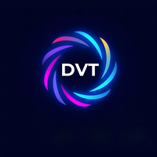
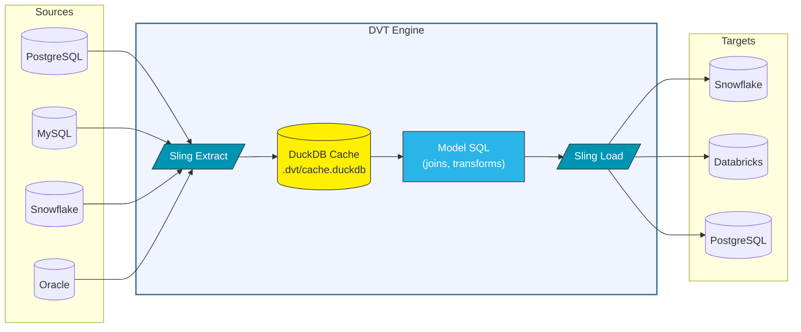

<p align="center">
  
</p>

<h1 align="center">DVT — Data Virtualization Tool</h1>

<p align="center">
  <strong>Connect every database. Transform across engines. Materialize anywhere.</strong>
</p>

<p align="center">
  <a href="https://pypi.org/project/dvt-ce/"></a>
  <a href="https://pypi.org/project/dvt-adapters/"></a>
  <a href="https://pypi.org/project/dvt-ce/"></a>
  <a href="https://discord.gg/UjQcxJXAQp"></a>
  <a href="https://github.com/heshamh96/dvt-ce/blob/master/LICENSE"></a>
</p>

---

**DVT** is a cross-engine data transformation tool built on [dbt-core](https://github.com/dbt-labs/dbt-core). Write SQL models that reference sources on **any database**, and DVT automatically handles cross-engine data movement and materializes results to **any target**.

No custom connectors. No complex config. Just SQL.

---

## How It Works

DVT extends dbt with **federated query execution**. When your sources and target live on the same engine, DVT pushes SQL directly to the database (identical to dbt). When they're on different engines, DVT transparently extracts, joins, and loads across engines:



### Two Execution Paths

| Path | When | How |
|------|------|-----|
| **Pushdown** | Source and target on same engine | SQL runs directly on the database via adapter — identical to dbt |
| **Extraction** | Sources on different engines | [Sling](https://slingdata.io) extracts → [DuckDB](https://duckdb.org) joins → Sling loads to target |

The user never thinks about this — DVT decides the path automatically.

---

## Supported Engines

**13 engines** in one package ([dvt-adapters](https://pypi.org/project/dvt-adapters/)):

| | Engine | Type | | Engine | Type |
|---|--------|------|-|--------|------|
| 🐘 | **PostgreSQL** | OLTP | ❄️ | **Snowflake** | Cloud DW |
| 🐬 | **MySQL** | OLTP | 🧱 | **Databricks** | Cloud DW |
| 🦭 | **MariaDB** | OLTP | 🔷 | **BigQuery** | Cloud DW |
| 🟥 | **SQL Server** | OLTP | 🟧 | **Redshift** | Cloud DW |
| 🔴 | **Oracle** | OLTP | 🦆 | **DuckDB** | Embedded |
| ⚡ | **Spark** | Distributed | 🔵 | **Fabric** | Cloud DW |
| | **MySQL 5** | Legacy | | | |

**Any source → Any target.** DVT handles the data movement.

---

## Installation

```bash
pip install dvt-ce dvt-adapters
```

Or with [uv](https://docs.astral.sh/uv/) (recommended):

```bash
uv add dvt-ce dvt-adapters
```

Then bootstrap your environment:

```bash
dvt sync    # Installs drivers, DuckDB extensions, Sling, cloud SDKs
```

---

## Quick Start

```bash
dvt init my_project && cd my_project   # Scaffold project
dvt sync                                # Install everything
dvt debug                               # Test all connections
dvt seed                                # Load CSV seed data
dvt run                                 # Run all models
dvt docs generate && dvt docs serve     # Engine-colored lineage docs
```

---

## Configuration

### Connections (`~/.dvt/profiles.yml`)

```yaml
my_project:
  target: pg_dev
  outputs:
    pg_dev:
      type: postgres
      host: localhost
      port: 5432
      user: analyst
      password: secret
      dbname: warehouse
      schema: public

    sf_prod:
      type: snowflake
      account: my-account
      user: loader
      password: secret
      database: ANALYTICS
      schema: PUBLIC
      warehouse: COMPUTE_WH

    mysql_crm:
      type: mysql
      host: mysql.example.com
      port: 3306
      user: reader
      password: secret
      database: crm
```

### Sources (`models/sources.yml`)

The `connection:` field maps sources to their engine:

```yaml
sources:
  - name: app_db           # On default target (no connection: needed)
    schema: public
    tables:
      - name: users
      - name: orders

  - name: crm              # On MySQL
    connection: mysql_crm
    schema: crm
    tables:
      - name: customers

  - name: marketing        # On Snowflake
    connection: sf_prod
    schema: PUBLIC
    tables:
      - name: campaigns
```

### Cross-Engine Model

```sql
-- models/dim_customer_campaigns.sql
{{ config(materialized='table', target='sf_prod') }}

SELECT
    u.user_id,
    u.email,
    c.customer_name,
    m.campaign_name
FROM {{ source('app_db', 'users') }} u           -- Postgres
LEFT JOIN {{ source('crm', 'customers') }} c      -- MySQL
    ON u.email = c.email
LEFT JOIN {{ source('marketing', 'campaigns') }} m -- Snowflake
    ON u.user_id = m.user_id
```

DVT detects the 3 engines, extracts to DuckDB, executes the join, loads to Snowflake. You see standard dbt output.

### Incremental Models

```sql
{{ config(materialized='incremental', incremental_strategy='append', target='sf_prod') }}

SELECT * FROM {{ source('app_db', 'orders') }}

WHERE order_date > (SELECT MAX(order_date) FROM {{ this }})

```

DVT reads the watermark from the target, extracts only new rows, appends them.

---

## Two Dialects, One Project

| Path | You Write | Runs On |
|------|-----------|---------|
| **Pushdown** | Target's native SQL (Snowflake SQL, T-SQL, etc.) | Target database |
| **Extraction** | DuckDB SQL (Postgres-like) | Local DuckDB cache |

Both coexist naturally. The dialect is determined by the execution path, not config.

---

## Commands

### Core

| Command | Description |
|---------|-------------|
| `dvt run` | Execute models against targets |
| `dvt run --full-refresh` | Rebuild everything from scratch |
| `dvt run --select +model_name` | Run model and all ancestors |
| `dvt build` | Seeds + models + snapshots + tests in DAG order |
| `dvt seed` | Load CSVs via Sling (10-100x faster than dbt) |
| `dvt test` | Run data tests |
| `dvt compile` | Compile SQL without executing |

### DVT-Specific

| Command | Description |
|---------|-------------|
| `dvt sync` | Self-healing env bootstrap (drivers, DuckDB, Sling, cloud SDKs) |
| `dvt debug` | Test all connections with clean status output |
| `dvt show --select model` | Query locally via DuckDB (no target needed) |
| `dvt retract` | Drop models from targets in reverse DAG order |
| `dvt retract --select +model` | Drop a model and its entire upstream chain |
| `dvt clean` | Remove build artifacts + DuckDB cache |

### Documentation

| Command | Description |
|---------|-------------|
| `dvt docs generate` | Cross-engine catalog with engine-colored lineage |
| `dvt docs serve` | Serve documentation website |

The docs UI features:
- Engine-colored nodes (each database has its brand color)
- Connection badges on every source and model
- Native column types from each engine
- Target and engine info in detail panels

---

## DuckDB Cache

DVT maintains a persistent cache at `.dvt/cache.duckdb`:

- **Source tables**: `{source}__{table}` — shared across models, reused between runs
- **Model results**: `__model__{name}` — for incremental `{{ this }}` references
- `dvt run --full-refresh` rebuilds the cache
- `dvt clean` deletes `.dvt/` entirely

---

## `--target` Philosophy

`--target` switches **environments**, not engines:

```bash
dvt run --target dev_snowflake     # Dev Snowflake
dvt run --target prod_snowflake    # Prod Snowflake  ← Same engine, different env
```

Pushdown models use the target's SQL dialect. Extraction models use DuckDB SQL and are unaffected by target changes.

---

## dbt Compatibility

All dbt projects are valid DVT projects. When using a single adapter with no cross-engine references, DVT behaves identically to dbt.

---

## Community

<p align="center">
  <a href="https://discord.gg/UjQcxJXAQp">
    
  </a>
</p>

- **Discord**: [Join the DVT community](https://discord.gg/UjQcxJXAQp)
- **Issues**: [Report a bug](https://github.com/heshamh96/dvt-ce/issues)

---

## Links

| | |
|---|---|
| **PyPI** | [dvt-ce](https://pypi.org/project/dvt-ce/) · [dvt-adapters](https://pypi.org/project/dvt-adapters/) |
| **GitHub** | [dvt-ce](https://github.com/heshamh96/dvt-ce) · [dvt-adapters](https://github.com/heshamh96/dvt-adapters) |

## Built On

DVT stands on the shoulders of three exceptional open-source projects:

| Project | Role in DVT | License |
|---------|-------------|---------|
| [**dbt-core**](https://github.com/dbt-labs/dbt-core) | DAG orchestration, SQL models, Jinja, testing, docs, adapters | Apache 2.0 |
| [**Sling**](https://github.com/slingdata-io/sling-cli) | High-performance data movement across 30+ connectors (free tier) | Apache 2.0 |
| [**DuckDB**](https://github.com/duckdb/duckdb) | Local analytics engine — extraction compute, caching, `dvt show` | MIT |

We are grateful to [dbt Labs](https://www.getdbt.com/), [Sling Data](https://slingdata.io/), and the [DuckDB Foundation](https://duckdb.org/) for building and open-sourcing these tools.

## License

DVT is licensed under the [Apache License 2.0](LICENSE).

```
Copyright 2025-2026 Hesham Badawi.
Licensed under the Apache License, Version 2.0.
```

---

<p align="center">
  <sub>Built by data engineers, for data engineers.</sub>
</p>
